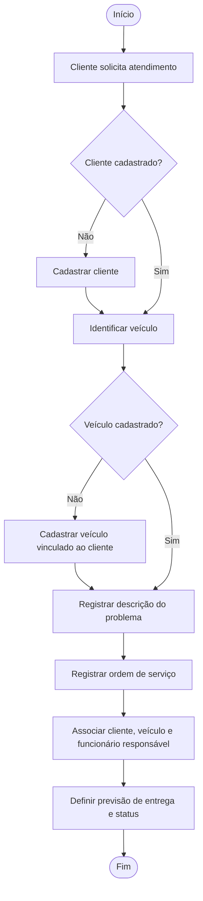
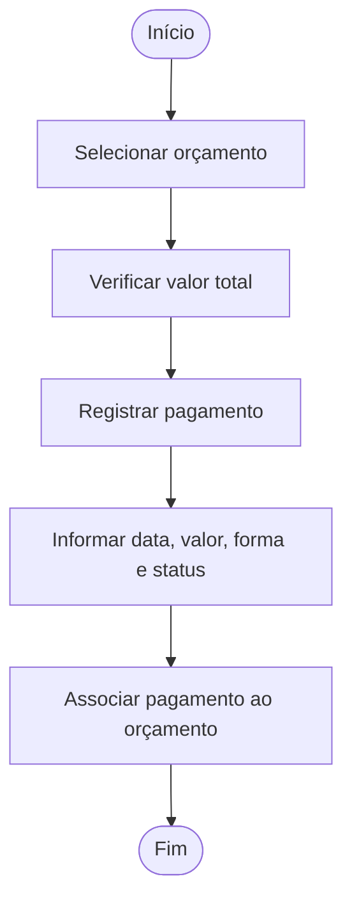
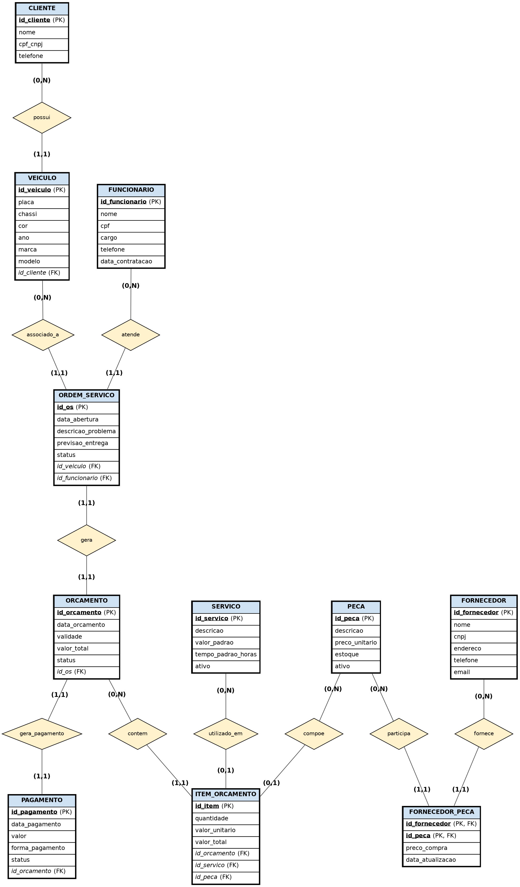

# Projeto ERP — Prime Funilaria

Projeto Integrador de Modelagem de Dados: do problema real ao Modelo Conceitual de Dados (DER) de um sistema ERP para uma funilaria automotiva.

---

## 1. Identificação da equipe

**Curso:** Engenharia de Software
**Disciplina:** Modelagem de Dados
**Projeto:** Sistema ERP — Prime Funilaria
**Grupo:** 04

| Integrante | RA |
|---|---|
| Felipe de Souza Ferreira | 48120863 |
| Kayke Queriquieri da Silva | 47556897 |
| Jonathan Nery Lacerda | 47734213 |
| Kaiky dos Santos Ferreira | 47802928 |
| Davi Melo Salgueiro Leonardo | 48129470 |
| Ruan Sousa Silva | 47347805 |
| Vinicius de Oliveira | 47710608 |
| Leonardo (sobrenome a informar) | a informar |
| Leonardo 2 (sobrenome a informar) | a informar |

---

## 2. Caracterização da empresa

**Nome:** Prime Funilaria
**Segmento:** funilaria automotiva (reparação de lataria e pintura, com substituição de peças).

**O que oferece.** Serviços de reparação automotiva, prestados com a utilização de peças. O valor cobrado do cliente é composto por **serviços** (mão de obra) e **peças**, apresentados em um orçamento.

**Principais clientes.** Proprietários ou responsáveis por veículos (pessoas físicas ou empresas, identificados por CPF ou CNPJ) que procuram a empresa para reparar danos ao veículo.

**Principais setores e envolvidos.**

| Setor / envolvido | Papel |
|---|---|
| Clientes | Solicitam serviços e são proprietários dos veículos atendidos |
| Atendimento | Cadastra clientes e veículos e abre as ordens de serviço |
| Funcionários | Executam e respondem pelas ordens de serviço |
| Orçamentos | Define serviços e peças necessários e calcula valores |
| Estoque | Controla as peças disponíveis |
| Fornecedores | Fornecem as peças utilizadas pela empresa |
| Financeiro | Registra os pagamentos |

**Como funciona atualmente.**
Hoje a Prime Funilaria não utiliza nenhum sistema: todo o controle é feito em papel, com fichas, formulários e anotações guardados em pastas, sem nada que ligue as etapas do atendimento:

- **Atendimento.** Quando o cliente chega, o atendente anota em uma ficha de papel o nome, o telefone e o CPF/CNPJ do cliente e os dados do veículo (placa, chassi, marca, modelo, cor e ano). Como não existe uma base única, o mesmo cliente pode ser anotado mais de uma vez, e para encontrar o histórico de atendimentos de um veículo é preciso procurar entre as fichas guardadas.
- **Ordem de serviço.** A ordem é preenchida em um formulário de papel, com a descrição do problema, a previsão de entrega e o nome do funcionário que cuidará do carro. O andamento (aberta, em andamento, concluída) só é conhecido perguntando ao responsável ou procurando o papel da ordem.
- **Orçamento.** O funcionário analisa o veículo e escreve o orçamento à mão, listando os serviços e as peças necessários, com quantidades e valores, e calcula o total e a validade. A ligação entre o orçamento e a ordem de serviço depende de os papéis estarem juntos, e os preços dos serviços e das peças são escritos novamente a cada orçamento.
- **Peças, estoque e fornecedores.** O estoque de peças é conferido de forma manual (contagem e anotações em papel), o que gera divergência entre a quantidade registrada e a real. Os preços de compra são combinados com cada fornecedor por telefone ou mensagem e não ficam registrados em um só lugar, o que dificulta comparar fornecedores e saber o custo de cada peça.
- **Pagamento.** O recebimento é anotado no caixa ou em recibo de papel, sem indicar com clareza a qual orçamento ou ordem de serviço ele se refere.

Como consequência, a empresa tem dificuldade para saber qual veículo está em qual atendimento, quem é o responsável, quanto foi orçado, quais peças ainda existem em estoque, qual fornecedor oferece o melhor preço e quanto já foi pago, além do risco de perda ou extravio dos papéis. É esse conjunto de problemas que o sistema ERP deverá resolver, integrando cadastros, ordens, orçamentos, estoque, fornecedores e pagamentos em uma única base de dados.

**Informações importantes para o negócio.** Dados do cliente e do veículo; histórico de ordens de serviço por veículo; funcionário responsável por cada atendimento; composição e validade do orçamento; estoque e preço das peças; preço de compra por fornecedor; pagamentos.

---

## 3. Justificativa da escolha

A funilaria foi escolhida porque reúne, em um único negócio pequeno, processos encadeados que dependem uns dos outros: o atendimento gera uma ordem de serviço, que gera um orçamento, que consome serviços e peças, que dependem de estoque e fornecedores, e termina em um pagamento. Como a desorganização em uma etapa prejudica as demais, o negócio justifica a **integração** típica de um ERP.

Para a modelagem de dados, o negócio permite aplicar:

- relacionamentos **1:N** (cliente–veículo, orçamento–itens);
- relacionamento **1:1** (ordem de serviço–orçamento);
- relacionamento **N:N com atributos próprios** (fornecedor–peça, com preço de compra e data de atualização), resolvido por entidade associativa e chave composta;
- uma regra de **exclusividade** (item de orçamento é serviço ou peça);
- controle de **estoque** e de situação ativa/inativa de cadastros.

---

## 4. Problemas identificados

| Problema | Consequência | Requisitos que respondem |
|---|---|---|
| Dados de clientes sem centralização | Dificuldade para consultar informações e risco de duplicidade | RF01, RF02 |
| Dados dos veículos desorganizados | Dificuldade para identificar o veículo e seu histórico | RF03, RF04 |
| Controle manual das ordens de serviço | Dificuldade para acompanhar atendimentos, prazos e status | RF09, RF10, RF19 |
| Controle manual dos orçamentos | Dificuldade para acompanhar valores e validade | RF12, RF13, RF14, RF20 |
| Controle manual de peças e estoque | Erros na quantidade disponível | RF07, RF15 |
| Preços de fornecedores não registrados | Dificuldade para comparar fornecedores e saber o custo das peças | RF08, RF16, RF17 |
| Pagamentos sem vínculo claro com o orçamento | Dificuldade para acompanhar valores pagos | RF18 |
| Responsável pelo atendimento não registrado | Dificuldade para identificar quem responde pela ordem | RF05, RF11 |

**Necessidades.** Cadastrar clientes, veículos, funcionários, serviços, peças e fornecedores; abrir ordens de serviço ligadas a veículo e funcionário; gerar orçamentos compostos por itens; controlar estoque; relacionar fornecedores e peças com preço de compra; registrar pagamentos; consultar essas informações.

---

## 5. Processos de negócio

| Processo | Quem participa | O que inicia | O que acontece | Informação gerada | Resultado |
|---|---|---|---|---|---|
| Cadastro de cliente | Atendimento, cliente | Cliente novo solicita atendimento | Registra nome, CPF/CNPJ e telefone | CLIENTE | Cliente cadastrado |
| Cadastro de veículo | Atendimento, cliente | Veículo ainda não cadastrado | Registra placa, chassi, cor, ano, marca e modelo vinculados ao proprietário | VEICULO | Veículo vinculado ao cliente |
| Abertura de ordem de serviço | Atendimento, funcionário | Cliente solicita reparo | Registra cliente solicitante, veículo, problema, previsão de entrega, status e funcionário responsável | ORDEM_SERVICO | OS aberta |
| Geração do orçamento | Funcionário, orçamentos | OS aberta | Define serviços e peças, quantidades e valores; calcula total e validade | ORCAMENTO, ITEM_ORCAMENTO | Orçamento emitido |
| Controle de peças e fornecedores | Estoque, fornecedores | Necessidade de peça ou atualização de preço | Cadastra peça, confere estoque, relaciona fornecedor com preço de compra e data | PECA, FORNECEDOR, FORNECEDOR_PECA | Peça com fornecedores e custo registrados |
| Registro do pagamento | Financeiro, cliente | Orçamento definido | Registra data, valor, forma e status | PAGAMENTO | Orçamento com pagamento associado |

---

## 6. Requisitos funcionais

- **RF01:** O sistema deverá cadastrar clientes.
- **RF02:** O sistema deverá consultar clientes.
- **RF03:** O sistema deverá cadastrar veículos.
- **RF04:** O sistema deverá associar cada veículo a um cliente proprietário.
- **RF05:** O sistema deverá cadastrar funcionários.
- **RF06:** O sistema deverá cadastrar serviços e permitir ativá-los ou inativá-los.
- **RF07:** O sistema deverá cadastrar peças e permitir ativá-las ou inativá-las.
- **RF08:** O sistema deverá cadastrar fornecedores.
- **RF09:** O sistema deverá abrir ordens de serviço.
- **RF10:** O sistema deverá associar a ordem de serviço ao cliente solicitante e ao veículo atendido.
- **RF11:** O sistema deverá associar um funcionário responsável à ordem de serviço.
- **RF12:** O sistema deverá gerar um orçamento a partir da ordem de serviço.
- **RF13:** O sistema deverá registrar os itens do orçamento, cada um sendo um serviço ou uma peça, com quantidade e valores.
- **RF14:** O sistema deverá calcular o valor total do orçamento.
- **RF15:** O sistema deverá controlar o estoque das peças.
- **RF16:** O sistema deverá relacionar fornecedores e peças.
- **RF17:** O sistema deverá registrar o preço de compra e a data de atualização na relação fornecedor/peça.
- **RF18:** O sistema deverá registrar o pagamento de um orçamento.
- **RF19:** O sistema deverá consultar ordens de serviço (inclusive por cliente e por veículo).
- **RF20:** O sistema deverá consultar orçamentos.

---

## 7. Requisitos não funcionais

- **RNF01 — Segurança:** o sistema deverá proteger os dados armazenados contra acesso não autorizado.
- **RNF02 — Controle de acesso:** o sistema deverá controlar as operações permitidas conforme o perfil do usuário (atendimento, estoque e financeiro).
- **RNF03 — Rastreabilidade:** o sistema deverá manter registro das operações realizadas pelos usuários.
- **RNF04 — Integridade:** o sistema deverá preservar a integridade dos relacionamentos entre os dados.
- **RNF05 — Confiabilidade:** o sistema deverá manter os dados consistentes, evitando duplicidade de CPF/CNPJ, placa e chassi.
- **RNF06 — Usabilidade:** o sistema deverá apresentar as informações de forma clara para usuários sem formação técnica.
- **RNF07 — Desempenho:** o sistema deverá apresentar as consultas em tempo adequado para uso operacional.
- **RNF08 — Disponibilidade:** o sistema deverá estar disponível durante o horário de funcionamento da empresa.

---

## 8. Regras de negócio

| Código | Regra |
|---|---|
| RN01 | Um cliente pode possuir nenhum ou vários veículos. |
| RN02 | Cada veículo pertence a exatamente um cliente. |
| RN03 | Um veículo pode ter nenhuma ou várias ordens de serviço. |
| RN04 | Cada ordem de serviço refere-se a exatamente um veículo. |
| RN05 | Um funcionário pode atender nenhuma ou várias ordens de serviço. |
| RN06 | Cada ordem de serviço possui exatamente um funcionário responsável. |
| RN07 | Cada ordem de serviço gera no máximo um orçamento: a ordem é aberta primeiro e o orçamento só é criado depois da análise do veículo. |
| RN08 | Cada orçamento pertence a exatamente uma ordem de serviço. |
| RN09 | Um orçamento pode possuir nenhum ou vários itens. |
| RN10 | Cada item pertence a exatamente um orçamento. |
| RN11 | Um serviço pode estar em nenhum ou vários itens; um item refere-se a no máximo um serviço. |
| RN12 | Uma peça pode estar em nenhum ou vários itens; um item refere-se a no máximo uma peça. |
| RN13 | Cada item deve referir-se a exatamente um serviço **ou** uma peça, nunca aos dois e nunca a nenhum. |
| RN14 | Cada orçamento possui no máximo um pagamento: o pagamento só é registrado depois que o orçamento é definido, e um orçamento pode expirar sem ser pago. |
| RN15 | Cada pagamento pertence a exatamente um orçamento. |
| RN16 | Um fornecedor pode fornecer nenhuma ou várias peças. |
| RN17 | Uma peça pode ter nenhum ou vários fornecedores. |
| RN18 | A relação fornecedor/peça registra preço de compra e data de atualização. |
| RN19 | Cada peça possui uma quantidade em estoque registrada. |
| RN20 | Serviços e peças podem ser ativos ou inativos; inativos não devem ser incluídos em novos orçamentos. |
| RN21 | O valor unitário do item é gravado no orçamento e não muda se o preço padrão do serviço ou da peça for alterado depois. |
| RN22 | Um cliente pode solicitar nenhuma ou várias ordens de serviço. |
| RN23 | Cada ordem de serviço é solicitada por exatamente um cliente, que pode ou não ser o proprietário do veículo atendido. |

---

## 9. Restrições e políticas organizacionais

1. Um veículo não pode ser cadastrado sem cliente proprietário.
2. Uma ordem de serviço não pode ser registrada sem cliente solicitante, sem veículo e sem funcionário responsável.
3. Uma ordem de serviço gera no máximo um orçamento, e todo orçamento pertence a uma única ordem.
4. Cada item de orçamento representa uma peça ou um serviço (RN13).
5. Toda peça deve possuir controle de estoque, e a quantidade em estoque não pode ser negativa.
6. O preço de compra e a data de atualização são registrados por par fornecedor/peça, pois a mesma peça pode ter preços diferentes em fornecedores diferentes.
7. Cada orçamento possui no máximo um pagamento; todo pagamento pertence a um único orçamento.
8. Serviços e peças inativos não são oferecidos em novos orçamentos, mas permanecem no histórico dos orçamentos antigos.
9. Orçamentos com validade vencida devem ser identificados pelo status e não tratados como vigentes.
10. O acesso às operações depende do perfil do usuário (RNF02).

---

## 10. Fluxogramas

### 10.1 Cadastro e ordem de serviço



### 10.2 Geração do orçamento


### 10.3 Peças e fornecedores


### 10.4 Pagamento



**Integração entre os processos.** O cadastro e a ordem de serviço (10.1) alimentam o orçamento (10.2); o orçamento usa serviços e peças cadastrados, cujo estoque e fornecedores são tratados em 10.3; e o orçamento fecha com o pagamento (10.4).

---

## 11. Entidades

| Entidade | Descrição | Por que existe |
|---|---|---|
| CLIENTE | Proprietário do veículo | Identifica quem solicita e paga o serviço |
| VEICULO | Veículo atendido | Permite histórico por veículo |
| FUNCIONARIO | Responsável pela OS | Identifica quem responde pelo atendimento |
| ORDEM_SERVICO | Atendimento solicitado | Registra problema, prazo e status |
| ORCAMENTO | Proposta de valores da OS | Controla total e validade |
| ITEM_ORCAMENTO | Linha do orçamento | Compõe o orçamento com serviço ou peça |
| SERVICO | Serviço oferecido | Catálogo de mão de obra |
| PECA | Peça utilizada | Catálogo e estoque |
| FORNECEDOR | Quem fornece peças | Identifica a origem das peças |
| FORNECEDOR_PECA | Associativa fornecedor/peça | Resolve o N:N e guarda preço de compra e data |
| PAGAMENTO | Pagamento do orçamento | Controle financeiro |

---

## 12. Atributos

Classificação: **identificador** (chave primária), **obrigatório**, **opcional** e **derivado** (calculado a partir de outros). Todos os atributos são monovalorados. Os atributos são tratados como simples; a única exceção em potencial é `endereco` (FORNECEDOR), mantido como um campo único de texto nesta etapa e que poderá ser decomposto (logradouro, cidade, etc.) no modelo lógico.

| Entidade | Identificador | Obrigatórios | Opcionais | Derivados |
|---|---|---|---|---|
| CLIENTE | id_cliente | nome, cpf_cnpj | telefone | — |
| VEICULO | id_veiculo | placa, chassi, marca, modelo | cor, ano | — |
| FUNCIONARIO | id_funcionario | nome, cpf, cargo, data_contratacao | telefone | — |
| ORDEM_SERVICO | id_os | data_abertura, descricao_problema, status | previsao_entrega | — |
| ORCAMENTO | id_orcamento | data_orcamento, validade, status | — | valor_total (soma dos itens) |
| ITEM_ORCAMENTO | id_item | quantidade, valor_unitario | — | valor_total (quantidade × valor_unitario) |
| SERVICO | id_servico | descricao, valor_padrao, ativo | tempo_padrao_horas | — |
| PECA | id_peca | descricao, preco_unitario, estoque, ativo | — | — |
| FORNECEDOR | id_fornecedor | nome, cnpj | endereco, telefone, email | — |
| FORNECEDOR_PECA | combinação FORNECEDOR + PECA | preco_compra, data_atualizacao | — | — |
| PAGAMENTO | id_pagamento | data_pagamento, valor, forma_pagamento, status | — | — |

As chaves estrangeiras não são atributos do modelo conceitual: elas surgem do mapeamento dos relacionamentos no modelo lógico (prévia na seção 16). Os vínculos entre as entidades estão nas seções 13 e 14.

---

## 13. Relacionamentos

| Relacionamento | Entidades | Leitura |
|---|---|---|
| possui | CLIENTE — VEICULO | Um cliente possui veículos |
| solicita | CLIENTE — ORDEM_SERVICO | Um cliente solicita ordens de serviço |
| associado_a | VEICULO — ORDEM_SERVICO | Um veículo é associado a ordens de serviço |
| atende | FUNCIONARIO — ORDEM_SERVICO | Um funcionário atende ordens de serviço |
| gera | ORDEM_SERVICO — ORCAMENTO | Uma ordem gera, no máximo, um orçamento |
| contem | ORCAMENTO — ITEM_ORCAMENTO | Um orçamento contém itens |
| utilizado_em | SERVICO — ITEM_ORCAMENTO | Um serviço é utilizado em itens |
| compoe | PECA — ITEM_ORCAMENTO | Uma peça compõe itens |
| gera_pagamento | ORCAMENTO — PAGAMENTO | Um orçamento gera, no máximo, um pagamento |
| fornece | FORNECEDOR — FORNECEDOR_PECA | Um fornecedor fornece peças |
| participa | PECA — FORNECEDOR_PECA | Uma peça participa de fornecimentos |

### Atributos dos relacionamentos

| Relacionamento | Possui atributo próprio? | Justificativa |
|---|---|---|
| FORNECEDOR — PECA (N:N) | **Sim:** preco_compra, data_atualizacao | O preço de compra não descreve só o fornecedor nem só a peça, e sim o fornecimento daquela peça por aquele fornecedor (RN18). Por isso o relacionamento vira a entidade associativa FORNECEDOR_PECA. |
| Demais relacionamentos | Não | São 1:1 ou 1:N; qualquer informação descreve diretamente uma das entidades (quantidade e valor_unitario descrevem o item, não o vínculo orçamento–serviço). |

---

## 14. Cardinalidades

Método **"vá e volte"**: cada relacionamento foi analisado nos dois sentidos. Notação: ENTIDADE (mín,máx) — relacionamento — ENTIDADE (mín,máx), em que a cardinalidade ao lado de cada entidade indica com quantas ocorrências da outra entidade ela se relaciona.

| Relacionamento | Vá | Volta | Tipo | Regra |
|---|---|---|---|---|
| CLIENTE (0,N) — possui — VEICULO (1,1) | Um cliente possui quantos veículos? **0,N** | Um veículo pertence a quantos clientes? **1,1** | 1:N | RN01, RN02 |
| CLIENTE (0,N) — solicita — ORDEM_SERVICO (1,1) | Um cliente solicita quantas ordens? **0,N** | Uma ordem é solicitada por quantos clientes? **1,1** | 1:N | RN22, RN23 |
| VEICULO (0,N) — associado_a — ORDEM_SERVICO (1,1) | Um veículo tem quantas ordens? **0,N** | Uma ordem refere-se a quantos veículos? **1,1** | 1:N | RN03, RN04 |
| FUNCIONARIO (0,N) — atende — ORDEM_SERVICO (1,1) | Um funcionário atende quantas ordens? **0,N** | Uma ordem tem quantos responsáveis? **1,1** | 1:N | RN05, RN06 |
| ORDEM_SERVICO (0,1) — gera — ORCAMENTO (1,1) | Uma ordem gera quantos orçamentos? **0,1** | Um orçamento pertence a quantas ordens? **1,1** | 1:1 | RN07, RN08 |
| ORCAMENTO (0,N) — contem — ITEM_ORCAMENTO (1,1) | Um orçamento tem quantos itens? **0,N** | Um item pertence a quantos orçamentos? **1,1** | 1:N | RN09, RN10 |
| SERVICO (0,N) — utilizado_em — ITEM_ORCAMENTO (0,1) | Um serviço está em quantos itens? **0,N** | Um item tem quantos serviços? **0,1** | 1:N | RN11, RN13 |
| PECA (0,N) — compoe — ITEM_ORCAMENTO (0,1) | Uma peça está em quantos itens? **0,N** | Um item tem quantas peças? **0,1** | 1:N | RN12, RN13 |
| ORCAMENTO (0,1) — gera_pagamento — PAGAMENTO (1,1) | Um orçamento tem quantos pagamentos? **0,1** | Um pagamento pertence a quantos orçamentos? **1,1** | 1:1 | RN14, RN15 |
| FORNECEDOR (0,N) — fornece — PECA (0,N) | Um fornecedor fornece quantas peças? **0,N** | Uma peça tem quantos fornecedores? **0,N** | N:N | RN16, RN17 |

**Leitura dos relacionamentos 1:1.** Em ORDEM_SERVICO—ORCAMENTO e em ORCAMENTO—PAGAMENTO o mínimo é 0 do lado da ordem e do orçamento porque o processo é sequencial (seção 10): a ordem é aberta antes de existir orçamento, e o orçamento é definido antes de existir pagamento (ou expira sem ser pago). Já o orçamento sempre pertence a uma ordem e o pagamento sempre pertence a um orçamento, por isso o lado de baixo é (1,1).

### Verificação de relacionamentos N:N

Só é N:N quando a resposta é "vários" nos **dois** sentidos.

| Par | A → B vários? | B → A vários? | N:N? |
|---|---|---|---|
| Cliente — Veículo | Sim | Não | Não |
| Cliente — Ordem de serviço | Sim | Não | Não |
| Veículo — Ordem de serviço | Sim | Não | Não |
| Funcionário — Ordem de serviço | Sim | Não | Não |
| Ordem de serviço — Orçamento | Não | Não | Não |
| Orçamento — Item | Sim | Não | Não |
| Serviço — Item | Sim | Não | Não |
| Peça — Item | Sim | Não | Não |
| Orçamento — Pagamento | Não | Não | Não |
| **Fornecedor — Peça** | **Sim** | **Sim** | **Sim** |

O único N:N é Fornecedor — Peça, resolvido por **FORNECEDOR_PECA**:

- FORNECEDOR (0,N) — fornece — FORNECEDOR_PECA (1,1)
- PECA (0,N) — participa — FORNECEDOR_PECA (1,1)

---

## 15. Dicionário de dados conceitual

Para cada entidade, os atributos são descritos (que dado é e para que serve), classificados e associados às regras de negócio. Classificação: **identificador**, **obrigatório**, **opcional** e **derivado**. Como o modelo é conceitual, os tipos de dados e as chaves estrangeiras serão definidos nas próximas etapas (modelo lógico e físico); aqui os vínculos entre entidades aparecem na linha **Relacionamentos** de cada entidade e na seção 14.

### CLIENTE
*Pessoa física ou empresa que solicita serviços e é proprietária de veículos.*

| Atributo | Descrição | Classificação | Regra / observação |
|---|---|---|---|
| `id_cliente` | Identificador único do cliente | Identificador | Identificação única |
| `nome` | Nome completo ou razão social | Obrigatório | — |
| `cpf_cnpj` | CPF ou CNPJ do cliente | Obrigatório | Não deve ser duplicado (RNF05) |
| `telefone` | Telefone de contato | Opcional | Pode ser informado depois |

**Relacionamentos:** possui VEICULO (RN01, RN02); solicita ORDEM_SERVICO (RN22, RN23).

### VEICULO
*Veículo atendido pela funilaria.*

| Atributo | Descrição | Classificação | Regra / observação |
|---|---|---|---|
| `id_veiculo` | Identificador do veículo | Identificador | Identificação única |
| `placa` | Placa do veículo | Obrigatório | Não deve ser duplicada (RNF05) |
| `chassi` | Número do chassi | Obrigatório | Não deve ser duplicado (RNF05) |
| `cor` | Cor do veículo | Opcional | — |
| `ano` | Ano do veículo | Opcional | — |
| `marca` | Fabricante do veículo | Obrigatório | — |
| `modelo` | Modelo do veículo | Obrigatório | — |

**Relacionamentos:** pertence a CLIENTE (RN01, RN02: todo veículo tem exatamente um proprietário); associado_a ORDEM_SERVICO (RN03, RN04).

### FUNCIONARIO
*Funcionário que responde pelas ordens de serviço.*

| Atributo | Descrição | Classificação | Regra / observação |
|---|---|---|---|
| `id_funcionario` | Identificador do funcionário | Identificador | Identificação única |
| `nome` | Nome completo | Obrigatório | — |
| `cpf` | CPF do funcionário | Obrigatório | Não deve ser duplicado |
| `cargo` | Função exercida | Obrigatório | — |
| `telefone` | Telefone de contato | Opcional | — |
| `data_contratacao` | Data de contratação | Obrigatório | — |

**Relacionamentos:** atende ORDEM_SERVICO (RN05, RN06).

### ORDEM_SERVICO
*Atendimento solicitado por um cliente para um veículo.*

| Atributo | Descrição | Classificação | Regra / observação |
|---|---|---|---|
| `id_os` | Identificador da ordem de serviço | Identificador | Identificação única |
| `data_abertura` | Data e hora de abertura da ordem | Obrigatório | — |
| `descricao_problema` | Problema apresentado pelo cliente | Obrigatório | — |
| `previsao_entrega` | Prazo estimado de entrega | Opcional | Pode ser definido após a análise do veículo |
| `status` | Situação da ordem | Obrigatório | Aberta, em andamento ou concluída |

**Relacionamentos:** solicitada por CLIENTE (RN22, RN23: o solicitante pode ser diferente do proprietário do veículo); referente a VEICULO (RN03, RN04); atendida por FUNCIONARIO (RN05, RN06); gera ORCAMENTO (RN07, RN08).

### ORCAMENTO
*Proposta de valores de uma ordem de serviço.*

| Atributo | Descrição | Classificação | Regra / observação |
|---|---|---|---|
| `id_orcamento` | Identificador do orçamento | Identificador | Identificação única |
| `data_orcamento` | Data de criação do orçamento | Obrigatório | — |
| `validade` | Data limite de validade | Obrigatório | Vencida a validade, o status passa a expirado |
| `valor_total` | Valor total do orçamento | Derivado | Soma dos valores totais dos itens (RF14) |
| `status` | Situação do orçamento | Obrigatório | Pendente, aprovado ou expirado |

**Relacionamentos:** gerado por ORDEM_SERVICO (RN07, RN08: a ordem gera no máximo um orçamento); contem ITEM_ORCAMENTO (RN09, RN10); gera_pagamento PAGAMENTO (RN14, RN15).

### ITEM_ORCAMENTO
*Linha do orçamento: um serviço ou uma peça, com quantidade e valor.*

| Atributo | Descrição | Classificação | Regra / observação |
|---|---|---|---|
| `id_item` | Identificador do item | Identificador | Identificação única |
| `quantidade` | Quantidade do serviço ou da peça | Obrigatório | Maior que zero |
| `valor_unitario` | Preço unitário no momento do orçamento | Obrigatório | Não muda se o preço padrão for alterado depois (RN21) |
| `valor_total` | Valor total do item | Derivado | quantidade × valor_unitario |

**Relacionamentos:** pertence a ORCAMENTO (RN09, RN10); utilizado_em SERVICO (RN11); compoe PECA (RN12).

> Regra RN13: cada item refere-se a exatamente um serviço ou uma peça, nunca aos dois e nunca a nenhum.

### SERVICO
*Serviço de mão de obra oferecido pela funilaria.*

| Atributo | Descrição | Classificação | Regra / observação |
|---|---|---|---|
| `id_servico` | Identificador do serviço | Identificador | Identificação única |
| `descricao` | Descrição do serviço | Obrigatório | — |
| `valor_padrao` | Valor de referência do serviço | Obrigatório | — |
| `tempo_padrao_horas` | Tempo estimado de execução, em horas | Opcional | — |
| `ativo` | Indica se o serviço está disponível | Obrigatório | Serviço inativo não entra em novos orçamentos (RN20) |

**Relacionamentos:** utilizado_em ITEM_ORCAMENTO (RN11).

### PECA
*Peça utilizada nos reparos, com controle de estoque.*

| Atributo | Descrição | Classificação | Regra / observação |
|---|---|---|---|
| `id_peca` | Identificador da peça | Identificador | Identificação única |
| `descricao` | Descrição da peça | Obrigatório | — |
| `preco_unitario` | Preço de venda de referência | Obrigatório | — |
| `estoque` | Quantidade disponível | Obrigatório | Não pode ser negativa (RN19) |
| `ativo` | Indica se a peça está disponível | Obrigatório | Peça inativa não entra em novos orçamentos (RN20) |

**Relacionamentos:** compoe ITEM_ORCAMENTO (RN12); participa de FORNECEDOR_PECA (RN17).

### FORNECEDOR
*Empresa que fornece peças.*

| Atributo | Descrição | Classificação | Regra / observação |
|---|---|---|---|
| `id_fornecedor` | Identificador do fornecedor | Identificador | Identificação única |
| `nome` | Nome ou razão social | Obrigatório | — |
| `cnpj` | CNPJ do fornecedor | Obrigatório | Não deve ser duplicado |
| `endereco` | Endereço | Opcional | Campo único de texto nesta etapa |
| `telefone` | Telefone de contato | Opcional | — |
| `email` | E-mail de contato | Opcional | — |

**Relacionamentos:** fornece, por meio de FORNECEDOR_PECA (RN16).

### FORNECEDOR_PECA (entidade associativa)
*Fornecimento de uma peça por um fornecedor; resolve o N:N entre FORNECEDOR e PECA.*

| Atributo | Descrição | Classificação | Regra / observação |
|---|---|---|---|
| (identificador) | Combinação de FORNECEDOR e PECA | Identificador | O par não pode se repetir (RN16, RN17) |
| `preco_compra` | Preço pago ao fornecedor por esta peça | Obrigatório | Pertence ao relacionamento, não à peça nem ao fornecedor (RN18) |
| `data_atualizacao` | Data da última atualização do preço | Obrigatório | RN18 |

**Relacionamentos:** liga FORNECEDOR (RN16) e PECA (RN17).

### PAGAMENTO
*Pagamento de um orçamento.*

| Atributo | Descrição | Classificação | Regra / observação |
|---|---|---|---|
| `id_pagamento` | Identificador do pagamento | Identificador | Identificação única |
| `data_pagamento` | Data e hora do pagamento | Obrigatório | — |
| `valor` | Valor pago | Obrigatório | — |
| `forma_pagamento` | Forma de pagamento | Obrigatório | Dinheiro, cartão ou PIX |
| `status` | Situação do pagamento | Obrigatório | Pendente ou confirmado |

**Relacionamentos:** referente a ORCAMENTO (RN14, RN15: o orçamento tem no máximo um pagamento).

---
## 16. DER

Notação: o DER é conceitual, por isso não mostra chaves estrangeiras (os vínculos são representados pelos relacionamentos). Retângulos são entidades (identificador sublinhado, atributos opcionais e derivados indicados ao lado do nome), losangos são relacionamentos (com os códigos das regras de negócio que os sustentam) e as cardinalidades (mín,máx) aparecem ao lado de cada entidade, como na seção 14. Uma prévia das chaves estrangeiras (modelo lógico) está ao final desta seção.



> Regra RN13: a linha tracejada vermelha entre `utilizado_em` e `compoe` indica que cada item de orçamento refere-se a um serviço **ou** a uma peça, nunca aos dois e nunca a nenhum. FORNECEDOR_PECA é a entidade associativa que resolve o N:N entre FORNECEDOR e PECA e guarda `preco_compra` e `data_atualizacao` (RN18); é identificada pela combinação das duas entidades.
>
> Atributos derivados (em marrom no desenho): `valor_total` de ORCAMENTO (soma dos itens) e `valor_total` de ITEM_ORCAMENTO (quantidade × valor_unitario), conforme a seção 12.

**Prévia para o modelo lógico — chaves primárias e estrangeiras**

O DER é conceitual e não mostra chaves estrangeiras. A tabela abaixo apenas antecipa como os relacionamentos serão implementados na próxima etapa.

| Tabela | Chave primária | Chaves estrangeiras |
|---|---|---|
| CLIENTE | id_cliente | — |
| VEICULO | id_veiculo | id_cliente |
| FUNCIONARIO | id_funcionario | — |
| ORDEM_SERVICO | id_os | id_cliente, id_veiculo, id_funcionario |
| ORCAMENTO | id_orcamento | id_os |
| PAGAMENTO | id_pagamento | id_orcamento |
| SERVICO | id_servico | — |
| PECA | id_peca | — |
| FORNECEDOR | id_fornecedor | — |
| ITEM_ORCAMENTO | id_item | id_orcamento, id_servico, id_peca |
| FORNECEDOR_PECA | id_fornecedor + id_peca | id_fornecedor, id_peca |

---

## 17. Justificativas técnicas

Cada decisão responde: **o que decidimos, por que, e qual regra ou necessidade a sustenta.**

| O que decidimos | Por que | Regra / necessidade |
|---|---|---|
| Cliente (0,N) e veículo (1,1) em CLIENTE—VEICULO | Um cliente pode estar cadastrado sem veículo e ter vários; um veículo nunca existe sem proprietário. | RN01, RN02 |
| Veículo (0,N) e ordem (1,1) em VEICULO—ORDEM_SERVICO | Um veículo novo ainda não tem ordens e pode ter várias ao longo do tempo; cada ordem trata de um único veículo. | RN03, RN04 |
| Funcionário (0,N) e ordem (1,1) em FUNCIONARIO—ORDEM_SERVICO | Um funcionário pode ainda não ter atendimentos; cada ordem tem exatamente um responsável. | RN05, RN06 |
| **Manter o relacionamento CLIENTE—ORDEM_SERVICO (solicita)**, além do vínculo com o veículo | Quem solicita e paga o serviço nem sempre é o proprietário do veículo (como um familiar ou o motorista de uma empresa). Guardar o solicitante na ordem também preserva o histórico se o proprietário do veículo mudar, por venda do carro. Por isso não é redundância: são papéis diferentes (proprietário do veículo × solicitante do serviço). | RN22, RN23 |
| ORDEM_SERVICO (0,1) e ORCAMENTO (1,1) em ORDEM_SERVICO—ORCAMENTO (1:1), em entidades separadas | A ordem é aberta antes do orçamento: na abertura ainda não há orçamento, por isso o mínimo é 0 do lado da ordem. Todo orçamento nasce de uma ordem, por isso é (1,1). A ordem registra o atendimento (problema, prazo, responsável); o orçamento registra valores, itens e validade, com status próprio. | RN07, RN08 |
| ORCAMENTO—ITEM_ORCAMENTO como 1:N | Um orçamento é composto por vários itens e cada item pertence a um só orçamento. | RN09, RN10 |
| ITEM_ORCAMENTO ligado a SERVICO (0,1) e a PECA (0,1), com exclusividade | Uma única entidade permite compor o orçamento com serviços e peças. Cada item refere-se a exatamente um dos dois, o que explica a cardinalidade (0,1) do lado do item em cada relacionamento e a regra de exclusividade (linha tracejada no DER). Na implementação física, deve ser garantido por restrição (CHECK). | RN11, RN12, RN13 |
| Valor total do item e do orçamento mantidos como atributos derivados | Facilitam consultas e preservam o valor emitido ao cliente. | RF14 |
| `valor_unitario` copiado para o item | Congela o preço do momento do orçamento; reajustes futuros não alteram orçamentos antigos. | RN21 |
| ORCAMENTO (0,1) e PAGAMENTO (1,1) em ORCAMENTO—PAGAMENTO (1:1), em entidades separadas | O pagamento só existe depois que o orçamento é definido, e um orçamento pode expirar ou ficar pendente sem pagamento, por isso o mínimo é 0 do lado do orçamento. Todo pagamento pertence a um orçamento, por isso é (1,1). O pagamento tem dados e status próprios (pendente ou confirmado), o que o torna uma entidade e facilita evoluir para vários pagamentos no futuro. | RN14, RN15 |
| Fornecedor—Peça considerado N:N | Um fornecedor fornece várias peças e uma peça pode ter vários fornecedores. | RN16, RN17 |
| Criar a entidade associativa FORNECEDOR_PECA | O N:N precisa ser decomposto em duas relações 1:N e há informação própria do fornecimento. | RN18 |
| `preco_compra` e `data_atualizacao` pertencem ao relacionamento, não a PECA nem a FORNECEDOR | O preço varia conforme o par fornecedor/peça: a mesma peça tem preços diferentes em fornecedores diferentes. | RN18, RF17 |
| FORNECEDOR_PECA identificada pela combinação FORNECEDOR + PECA (no modelo lógico, chave primária composta por `id_fornecedor` + `id_peca`) | A combinação dos dois identifica de forma única cada fornecimento e impede registrar o mesmo par duas vezes. | Diário de bordo (aula de 15/09), RN16, RN17 |
| Atributo `ativo` em SERVICO e PECA em vez de exclusão | Preserva o histórico de orçamentos antigos que usaram o cadastro. | RN20 |
| Atributo `estoque` em PECA | Cada peça precisa de quantidade controlada. | RN19, RF15 |
| Identificador próprio (id_*) em todas as entidades | Identificação única de cada ocorrência; na etapa lógica servirá de base para as chaves estrangeiras, preservando a integridade. | RNF04 |
| DER sem chaves estrangeiras | O DER é conceitual: os vínculos são representados pelos relacionamentos e suas cardinalidades; as chaves estrangeiras surgem no modelo lógico (prévia na seção 16). | Etapas 16 e 17 do manual da entrega |

### Escalabilidade e integração

**Integração.** As entidades formam uma cadeia ligada por relacionamentos: CLIENTE → VEICULO → ORDEM_SERVICO (ligada também ao CLIENTE solicitante) → ORCAMENTO → ITEM_ORCAMENTO → SERVICO/PECA → FORNECEDOR_PECA → FORNECEDOR, e ORCAMENTO → PAGAMENTO. Um dado cadastrado em um processo é reaproveitado nos seguintes, sem redigitação.

**Preparação para evolução.** O modelo permite, nas próximas etapas, sem refazer a base:

- transformar ORCAMENTO—PAGAMENTO em 1:N, caso a empresa passe a receber sinal e parcelas;
- criar tabelas de domínio para status e forma de pagamento;
- decompor `endereco` de FORNECEDOR (e de CLIENTE, se necessário) em atributos separados;
- registrar movimentações de estoque e o histórico de preços de compra.

---

## 18. Conclusão

A modelagem organiza os principais dados e processos da Prime Funilaria, de clientes e veículos até o pagamento, passando por ordens de serviço, orçamentos, serviços, peças e fornecedores. O DER foi construído a partir dos processos, requisitos e regras de negócio levantados, e cada entidade, atributo, relacionamento e cardinalidade tem justificativa ligada a uma regra. O modelo serve de base para as próximas etapas: modelo lógico, normalização, modelo físico e banco de dados.

---

### Anexo — Estrutura do repositório

```text
projeto-funilaria/
├── README.md
├── diagramas/
│   └── DER.png
└── documentos/
    └── dicionario de dados.pdf
    └── DIARIO DE BORDO_000205.pdf
```
