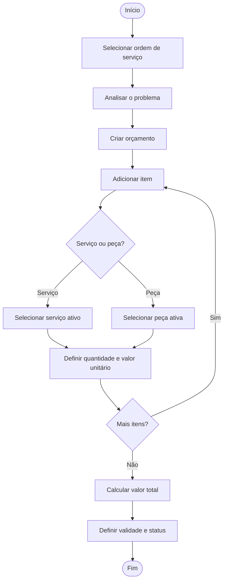
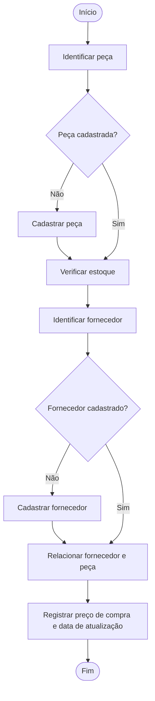
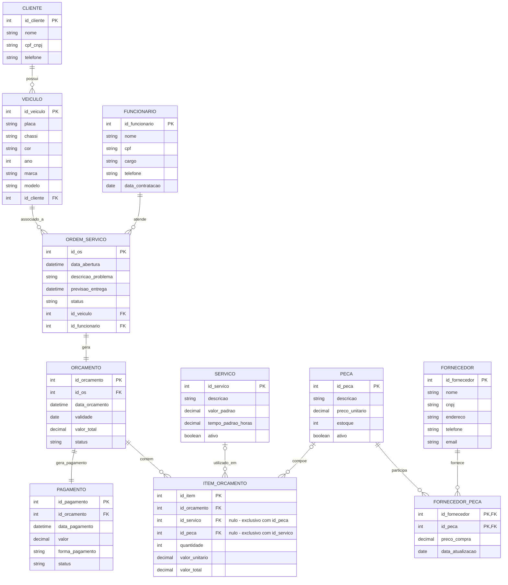

# Projeto ERP — Prime Funilaria

Projeto Integrador de Modelagem de Dados: do problema real ao Modelo Conceitual (DER) de um sistema ERP para uma funilaria automotiva.

---

## 1. Identificação da equipe

**Curso:** Engenharia de Software
**Disciplina:** Modelagem de Dados
**Projeto:** Sistema ERP para Funilaria — Prime Funilaria
**Grupo:** 04

| Integrante | RA |
|---|---|
| Felipe de Souza Ferreira | _preencher_ |
| Ruan Sousa Silva | _preencher_ |
| Kaiky Queriquieri | _preencher_ |
| _Nome do integrante 4 (se houver)_ | _preencher_ |

---

## 2. Caracterização da empresa

**Nome:** Prime Funilaria
**Segmento:** funilaria automotiva (reparação de lataria e pintura, com troca de peças).

### 2.1 O que a empresa oferece
Serviços de reparação automotiva (como reparo de lataria, pintura e substituição de componentes), prestados com a utilização de peças. O valor cobrado do cliente é composto por **serviços** (mão de obra) e **peças**, apresentados em um orçamento.

### 2.2 Principais clientes
Proprietários ou responsáveis por veículos (pessoas físicas ou empresas, identificados por CPF ou CNPJ) que procuram a empresa para reparar danos ao veículo.

### 2.3 Setores e envolvidos

| Setor / envolvido | Papel |
|---|---|
| Clientes | Solicitam serviços e são proprietários dos veículos atendidos |
| Atendimento | Cadastra clientes e veículos e abre as ordens de serviço |
| Funcionários | Executam e respondem pelas ordens de serviço |
| Orçamentos | Define serviços e peças necessários e calcula valores |
| Estoque | Controla as peças disponíveis |
| Fornecedores | Fornecem as peças utilizadas pela empresa |
| Financeiro | Registra os pagamentos |

### 2.4 Como funciona atualmente
<!-- CONFIRMAR COM O GRUPO: ajuste este parágrafo conforme a realidade da empresa -->
Hoje as informações da empresa estão dispersas: dados de clientes e veículos ficam em cadastros separados, as ordens de serviço e os orçamentos são registrados de forma manual (papel ou planilhas), o estoque de peças é conferido manualmente e os preços praticados pelos fornecedores não ficam centralizados. Isso dificulta saber qual veículo está em qual atendimento, quanto foi orçado, quais peças ainda existem em estoque e quanto foi pago.

### 2.5 Informações importantes para o negócio
Dados do cliente e do veículo; histórico de ordens de serviço por veículo; funcionário responsável por cada atendimento; composição e validade do orçamento; estoque e preço das peças; preço de compra por fornecedor; pagamentos.

---

## 3. Justificativa da escolha do negócio

A funilaria foi escolhida porque reúne, em um único negócio pequeno, processos encadeados que dependem uns dos outros: o atendimento gera uma ordem de serviço, que gera um orçamento, que consome serviços e peças, que dependem do estoque e dos fornecedores, e termina em um pagamento. Essa dependência faz com que a desorganização em uma etapa prejudique as demais, o que justifica a **integração** típica de um ERP.

Do ponto de vista da modelagem de dados, o negócio permite aplicar:
- relacionamentos **1:N** (cliente–veículo, orçamento–itens);
- relacionamento **1:1** (ordem de serviço–orçamento);
- relacionamento **N:N com atributos próprios** (fornecedor–peça, com preço de compra e data de atualização), resolvido por entidade associativa;
- uma regra de **exclusividade** (item de orçamento é serviço ou peça);
- controle de **estoque** e de situação ativa/inativa de cadastros.

---

## 4. Problemas e necessidades identificados

### 4.1 Problemas

| Problema | Consequência |
|---|---|
| Dados de clientes sem centralização | Dificuldade para consultar informações e risco de duplicidade |
| Dados dos veículos desorganizados | Dificuldade para identificar o veículo e seu histórico |
| Controle manual das ordens de serviço | Dificuldade para acompanhar atendimentos, prazos e status |
| Controle manual dos orçamentos | Dificuldade para acompanhar valores e validade |
| Controle manual de peças e estoque | Erros na quantidade disponível |
| Preços de fornecedores não registrados | Dificuldade para comparar fornecedores e saber o custo das peças |
| Pagamentos sem vínculo claro com o orçamento | Dificuldade para acompanhar valores pagos |
| Responsável pelo atendimento não registrado | Dificuldade para identificar quem responde pela ordem |

### 4.2 Necessidades
O sistema deverá permitir cadastrar clientes, veículos, funcionários, serviços, peças e fornecedores; abrir ordens de serviço ligadas a veículo e funcionário; gerar orçamentos compostos por itens; controlar estoque; relacionar fornecedores e peças com preço de compra; registrar pagamentos; e consultar todas essas informações.

---

## 5. Processos de negócio

| Processo | Quem participa | O que inicia | O que acontece | Informação gerada | Resultado |
|---|---|---|---|---|---|
| Cadastro de cliente | Atendimento, cliente | Cliente novo solicita atendimento | Registra nome, CPF/CNPJ e telefone | CLIENTE | Cliente cadastrado |
| Cadastro de veículo | Atendimento, cliente | Veículo ainda não cadastrado | Registra placa, chassi, cor, ano, marca e modelo vinculados ao proprietário | VEICULO | Veículo vinculado ao cliente |
| Abertura de ordem de serviço | Atendimento, funcionário | Cliente solicita reparo | Registra problema, previsão de entrega, status e funcionário responsável | ORDEM_SERVICO | OS aberta |
| Geração do orçamento | Funcionário, orçamentos | OS aberta | Define serviços e peças, quantidades e valores; calcula total e validade | ORCAMENTO, ITEM_ORCAMENTO | Orçamento emitido |
| Controle de peças e fornecedores | Estoque, fornecedores | Necessidade de peça ou atualização de preço | Cadastra peça, confere estoque, relaciona fornecedor com preço de compra e data | PECA, FORNECEDOR, FORNECEDOR_PECA | Peça com fornecedores e custo registrados |
| Registro do pagamento | Financeiro, cliente | Orçamento definido | Registra data, valor, forma e status | PAGAMENTO | Orçamento com pagamento associado |

---

## 6. Requisitos funcionais

- **RF01:** O sistema deverá cadastrar clientes.
- **RF02:** O sistema deverá consultar clientes.
- **RF03:** O sistema deverá cadastrar veículos.
- **RF04:** O sistema deverá associar cada veículo a um cliente proprietário.
- **RF05:** O sistema deverá cadastrar funcionários.
- **RF06:** O sistema deverá cadastrar serviços e permitir ativá-los ou inativá-los.
- **RF07:** O sistema deverá cadastrar peças e permitir ativá-las ou inativá-las.
- **RF08:** O sistema deverá cadastrar fornecedores.
- **RF09:** O sistema deverá abrir ordens de serviço.
- **RF10:** O sistema deverá associar a ordem de serviço a um veículo (o cliente é identificado pelo proprietário do veículo).
- **RF11:** O sistema deverá associar um funcionário responsável à ordem de serviço.
- **RF12:** O sistema deverá gerar um orçamento a partir da ordem de serviço.
- **RF13:** O sistema deverá registrar os itens do orçamento, cada um sendo um serviço ou uma peça, com quantidade e valores.
- **RF14:** O sistema deverá calcular o valor total do orçamento.
- **RF15:** O sistema deverá controlar o estoque das peças.
- **RF16:** O sistema deverá relacionar fornecedores e peças.
- **RF17:** O sistema deverá registrar o preço de compra e a data de atualização na relação fornecedor/peça.
- **RF18:** O sistema deverá registrar o pagamento de um orçamento.
- **RF19:** O sistema deverá consultar ordens de serviço (inclusive por cliente e por veículo).
- **RF20:** O sistema deverá consultar orçamentos.

---

## 7. Requisitos não funcionais

- **RNF01 — Segurança:** o sistema deverá proteger os dados armazenados contra acesso não autorizado.
- **RNF02 — Controle de acesso:** o sistema deverá controlar as operações permitidas conforme o perfil do usuário (por exemplo, atendimento, estoque, financeiro).
- **RNF03 — Rastreabilidade:** o sistema deverá manter registro das operações realizadas pelos usuários.
- **RNF04 — Integridade:** o sistema deverá preservar a integridade dos relacionamentos entre os dados (chaves estrangeiras).
- **RNF05 — Confiabilidade:** o sistema deverá manter os dados consistentes, evitando duplicidade de CPF/CNPJ, placa e chassi.
- **RNF06 — Usabilidade:** o sistema deverá apresentar as informações de forma clara para usuários sem formação técnica.
- **RNF07 — Desempenho:** o sistema deverá apresentar as consultas em tempo adequado para uso operacional.
- **RNF08 — Disponibilidade:** o sistema deverá estar disponível durante o horário de funcionamento da empresa.

---

## 8. Regras de negócio

| Código | Regra |
|---|---|
| RN01 | Um cliente pode possuir nenhum ou vários veículos. |
| RN02 | Cada veículo pertence a exatamente um cliente. |
| RN03 | Um veículo pode ter nenhuma ou várias ordens de serviço. |
| RN04 | Cada ordem de serviço refere-se a exatamente um veículo; o cliente da ordem é o proprietário desse veículo. |
| RN05 | Um funcionário pode atender nenhuma ou várias ordens de serviço. |
| RN06 | Cada ordem de serviço possui exatamente um funcionário responsável. |
| RN07 | Cada ordem de serviço gera exatamente um orçamento. |
| RN08 | Cada orçamento pertence a exatamente uma ordem de serviço. |
| RN09 | Um orçamento pode possuir nenhum ou vários itens. |
| RN10 | Cada item pertence a exatamente um orçamento. |
| RN11 | Um serviço pode estar em nenhum ou vários itens; um item refere-se a no máximo um serviço. |
| RN12 | Uma peça pode estar em nenhum ou vários itens; um item refere-se a no máximo uma peça. |
| RN13 | Cada item deve referir-se a exatamente um serviço **ou** uma peça, nunca aos dois e nunca a nenhum. |
| RN14 | Cada orçamento possui exatamente um pagamento. |
| RN15 | Cada pagamento pertence a exatamente um orçamento. |
| RN16 | Um fornecedor pode fornecer nenhuma ou várias peças. |
| RN17 | Uma peça pode ter nenhum ou vários fornecedores. |
| RN18 | A relação fornecedor/peça registra preço de compra e data de atualização. |
| RN19 | Cada peça possui uma quantidade em estoque registrada. |
| RN20 | Serviços e peças podem ser ativos ou inativos; itens inativos não devem ser incluídos em novos orçamentos. |
| RN21 | O valor unitário do item é gravado no orçamento e não muda se o preço padrão do serviço ou da peça for alterado depois. |

---

## 9. Restrições e políticas organizacionais

1. Um veículo não pode ser cadastrado sem cliente proprietário.
2. Uma ordem de serviço não pode ser registrada sem veículo e sem funcionário responsável.
3. Uma ordem de serviço gera um único orçamento, e um orçamento pertence a uma única ordem.
4. Cada item de orçamento representa uma peça ou um serviço (RN13).
5. Toda peça deve possuir controle de estoque.
6. O preço de compra e a data de atualização são registrados por par fornecedor/peça, pois o mesmo item pode ter preços diferentes em fornecedores diferentes.
7. Cada orçamento possui um único pagamento; cada pagamento pertence a um único orçamento.
8. Serviços e peças inativos não são oferecidos em novos orçamentos, mas permanecem no histórico dos orçamentos antigos.
9. O acesso às operações depende do perfil do usuário (RNF02).

---

## 10. Fluxogramas

### 10.1 Cadastro e ordem de serviço


### 10.2 Geração do orçamento



### 10.3 Peças e fornecedores



### 10.4 Pagamento


**Integração entre processos:** o cadastro e a ordem de serviço (10.1) alimentam o orçamento (10.2); o orçamento usa peças e serviços cadastrados, cujo estoque e fornecedores são tratados em 10.3; e o orçamento fecha com o pagamento (10.4).

---

## 11. Entidades

| Entidade | Descrição | Por que existe |
|---|---|---|
| CLIENTE | Proprietário do veículo | Identifica quem solicita e paga o serviço |
| VEICULO | Veículo atendido | Permite histórico por veículo |
| FUNCIONARIO | Responsável pela OS | Identifica quem responde pelo atendimento |
| ORDEM_SERVICO | Atendimento solicitado | Registra problema, prazo e status |
| ORCAMENTO | Proposta de valores da OS | Controla total e validade |
| ITEM_ORCAMENTO | Linha do orçamento | Compõe o orçamento com serviço ou peça |
| SERVICO | Serviço oferecido | Catálogo de mão de obra |
| PECA | Peça utilizada | Catálogo e estoque |
| FORNECEDOR | Quem fornece peças | Identifica a origem das peças |
| FORNECEDOR_PECA | Associativa fornecedor/peça | Resolve o N:N e guarda preço de compra e data |
| PAGAMENTO | Pagamento do orçamento | Controle financeiro |

---

## 12. Atributos

| Entidade | Atributos |
|---|---|
| CLIENTE | id_cliente, nome, cpf_cnpj, telefone |
| VEICULO | id_veiculo, placa, chassi, cor, ano, marca, modelo, id_cliente (FK) |
| FUNCIONARIO | id_funcionario, nome, cpf, cargo, telefone, data_contratacao |
| ORDEM_SERVICO | id_os, data_abertura, descricao_problema, previsao_entrega, status, id_veiculo (FK), id_funcionario (FK) |
| ORCAMENTO | id_orcamento, id_os (FK), data_orcamento, validade, valor_total, status |
| ITEM_ORCAMENTO | id_item, id_orcamento (FK), id_servico (FK), id_peca (FK), quantidade, valor_unitario, valor_total |
| SERVICO | id_servico, descricao, valor_padrao, tempo_padrao_horas, ativo |
| PECA | id_peca, descricao, preco_unitario, estoque, ativo |
| FORNECEDOR | id_fornecedor, nome, cnpj, endereco, telefone, email |
| FORNECEDOR_PECA | id_fornecedor (PK, FK), id_peca (PK, FK), preco_compra, data_atualizacao |
| PAGAMENTO | id_pagamento, id_orcamento (FK), data_pagamento, valor, forma_pagamento, status |

---

## 13. Relacionamentos

| Relacionamento | Entidades | Verbo (frase) |
|---|---|---|
| possui | CLIENTE — VEICULO | Um cliente possui veículos |
| associado_a | VEICULO — ORDEM_SERVICO | Um veículo é associado a ordens de serviço |
| atende | FUNCIONARIO — ORDEM_SERVICO | Um funcionário atende ordens de serviço |
| gera | ORDEM_SERVICO — ORCAMENTO | Uma ordem gera um orçamento |
| contem | ORCAMENTO — ITEM_ORCAMENTO | Um orçamento contém itens |
| utilizado_em | SERVICO — ITEM_ORCAMENTO | Um serviço é utilizado em itens |
| compoe | PECA — ITEM_ORCAMENTO | Uma peça compõe itens |
| gera_pagamento | ORCAMENTO — PAGAMENTO | Um orçamento gera um pagamento |
| fornece | FORNECEDOR — FORNECEDOR_PECA | Um fornecedor fornece peças |
| participa | PECA — FORNECEDOR_PECA | Uma peça participa de fornecimentos |

---

## 14. Cardinalidades (método "vá e volte")

| Relacionamento | Ida | Volta | Tipo | Regra |
|---|---|---|---|---|
| CLIENTE — VEICULO | Cliente tem quantos veículos? **(0,N)** | Veículo pertence a quantos clientes? **(1,1)** | 1:N | RN01, RN02 |
| VEICULO — ORDEM_SERVICO | Veículo tem quantas OS? **(0,N)** | OS refere-se a quantos veículos? **(1,1)** | 1:N | RN03, RN04 |
| FUNCIONARIO — ORDEM_SERVICO | Funcionário atende quantas OS? **(0,N)** | OS tem quantos responsáveis? **(1,1)** | 1:N | RN05, RN06 |
| ORDEM_SERVICO — ORCAMENTO | OS gera quantos orçamentos? **(1,1)** | Orçamento pertence a quantas OS? **(1,1)** | 1:1 | RN07, RN08 |
| ORCAMENTO — ITEM_ORCAMENTO | Orçamento tem quantos itens? **(0,N)** | Item pertence a quantos orçamentos? **(1,1)** | 1:N | RN09, RN10 |
| SERVICO — ITEM_ORCAMENTO | Serviço está em quantos itens? **(0,N)** | Item tem quantos serviços? **(0,1)** | 1:N | RN11, RN13 |
| PECA — ITEM_ORCAMENTO | Peça está em quantos itens? **(0,N)** | Item tem quantas peças? **(0,1)** | 1:N | RN12, RN13 |
| ORCAMENTO — PAGAMENTO | Orçamento tem quantos pagamentos? **(1,1)** | Pagamento pertence a quantos orçamentos? **(1,1)** | 1:1 | RN14, RN15 |
| FORNECEDOR — PECA | Fornecedor fornece quantas peças? **(0,N)** | Peça tem quantos fornecedores? **(0,N)** | N:N | RN16, RN17 |
| FORNECEDOR — FORNECEDOR_PECA | **(1,1)** do lado fornecedor | **(0,N)** do lado associativa | 1:N | Resolução do N:N |
| PECA — FORNECEDOR_PECA | **(1,1)** do lado peça | **(0,N)** do lado associativa | 1:N | Resolução do N:N |

---

## 15. Dicionário de dados conceitual

Legenda: **PK** chave primária · **FK** chave estrangeira · **Nulo?** indica se o campo pode ficar vazio.

### CLIENTE
| Atributo | Tipo | Nulo? | Chave | Descrição / regra |
|---|---|---|---|---|
| id_cliente | int | Não | PK | Identificador único do cliente |
| nome | string | Não | | Nome completo ou razão social |
| cpf_cnpj | string | Não | | CPF ou CNPJ; não deve ser duplicado |
| telefone | string | Sim | | Contato; pode ser informado depois |

### VEICULO
| Atributo | Tipo | Nulo? | Chave | Descrição / regra |
|---|---|---|---|---|
| id_veiculo | int | Não | PK | Identificador do veículo |
| placa | string | Não | | Placa; não deve ser duplicada |
| chassi | string | Não | | Número do chassi; não deve ser duplicado |
| cor | string | Sim | | Cor do veículo |
| ano | int | Sim | | Ano do veículo |
| marca | string | Não | | Fabricante |
| modelo | string | Não | | Modelo |
| id_cliente | int | Não | FK → CLIENTE | Proprietário; todo veículo tem exatamente um (RN02) |

### FUNCIONARIO
| Atributo | Tipo | Nulo? | Chave | Descrição / regra |
|---|---|---|---|---|
| id_funcionario | int | Não | PK | Identificador do funcionário |
| nome | string | Não | | Nome completo |
| cpf | string | Não | | CPF; não deve ser duplicado |
| cargo | string | Não | | Função exercida |
| telefone | string | Sim | | Contato |
| data_contratacao | date | Não | | Data de contratação |

### ORDEM_SERVICO
| Atributo | Tipo | Nulo? | Chave | Descrição / regra |
|---|---|---|---|---|
| id_os | int | Não | PK | Identificador da ordem |
| data_abertura | datetime | Não | | Data e hora de abertura |
| descricao_problema | string | Não | | Problema apresentado pelo cliente |
| previsao_entrega | datetime | Sim | | Prazo estimado; pode ser definido após análise |
| status | string | Não | | Situação da ordem (ex.: aberta, em andamento, concluída) |
| id_veiculo | int | Não | FK → VEICULO | Veículo atendido (RN04); o cliente é obtido por ele |
| id_funcionario | int | Não | FK → FUNCIONARIO | Responsável (RN06) |

### ORCAMENTO
| Atributo | Tipo | Nulo? | Chave | Descrição / regra |
|---|---|---|---|---|
| id_orcamento | int | Não | PK | Identificador do orçamento |
| id_os | int | Não | FK → ORDEM_SERVICO (único) | Uma OS gera um único orçamento (RN07) |
| data_orcamento | datetime | Não | | Data de criação |
| validade | date | Não | | Data limite de validade |
| valor_total | decimal | Não | | Soma dos valores dos itens |
| status | string | Não | | Situação (ex.: pendente, aprovado, expirado) |

### ITEM_ORCAMENTO
| Atributo | Tipo | Nulo? | Chave | Descrição / regra |
|---|---|---|---|---|
| id_item | int | Não | PK | Identificador do item |
| id_orcamento | int | Não | FK → ORCAMENTO | Orçamento ao qual pertence |
| id_servico | int | Sim | FK → SERVICO | Preenchido somente se o item for serviço |
| id_peca | int | Sim | FK → PECA | Preenchido somente se o item for peça |
| quantidade | int | Não | | Maior que zero |
| valor_unitario | decimal | Não | | Preço no momento do orçamento (RN21) |
| valor_total | decimal | Não | | quantidade × valor_unitario |

> Regra RN13: exatamente um entre `id_servico` e `id_peca` deve ser preenchido.

### SERVICO
| Atributo | Tipo | Nulo? | Chave | Descrição / regra |
|---|---|---|---|---|
| id_servico | int | Não | PK | Identificador do serviço |
| descricao | string | Não | | Descrição do serviço |
| valor_padrao | decimal | Não | | Valor de referência |
| tempo_padrao_horas | decimal | Sim | | Tempo estimado de execução |
| ativo | boolean | Não | | Serviço inativo não entra em novos orçamentos |

### PECA
| Atributo | Tipo | Nulo? | Chave | Descrição / regra |
|---|---|---|---|---|
| id_peca | int | Não | PK | Identificador da peça |
| descricao | string | Não | | Descrição da peça |
| preco_unitario | decimal | Não | | Preço de venda de referência |
| estoque | int | Não | | Quantidade disponível; não negativa |
| ativo | boolean | Não | | Peça inativa não entra em novos orçamentos |

### FORNECEDOR
| Atributo | Tipo | Nulo? | Chave | Descrição / regra |
|---|---|---|---|---|
| id_fornecedor | int | Não | PK | Identificador do fornecedor |
| nome | string | Não | | Nome ou razão social |
| cnpj | string | Não | | CNPJ; não deve ser duplicado |
| endereco | string | Sim | | Endereço |
| telefone | string | Sim | | Contato |
| email | string | Sim | | E-mail de contato |

### FORNECEDOR_PECA (entidade associativa)
| Atributo | Tipo | Nulo? | Chave | Descrição / regra |
|---|---|---|---|---|
| id_fornecedor | int | Não | PK, FK → FORNECEDOR | Parte da chave composta |
| id_peca | int | Não | PK, FK → PECA | Parte da chave composta |
| preco_compra | decimal | Não | | Preço pago ao fornecedor por esta peça |
| data_atualizacao | date | Não | | Data da última atualização do preço |

### PAGAMENTO
| Atributo | Tipo | Nulo? | Chave | Descrição / regra |
|---|---|---|---|---|
| id_pagamento | int | Não | PK | Identificador do pagamento |
| id_orcamento | int | Não | FK → ORCAMENTO (único) | Um pagamento por orçamento (RN14, RN15) |
| data_pagamento | datetime | Não | | Data e hora do pagamento |
| valor | decimal | Não | | Valor pago |
| forma_pagamento | string | Não | | Ex.: dinheiro, cartão, PIX |
| status | string | Não | | Situação (ex.: pendente, confirmado) |

---

## 16. Diagrama Entidade-Relacionamento (DER)

O código-fonte está em [`diagramas/DER.mmd`](diagramas/DER.mmd). Exportar a imagem em PNG para `diagramas/DER.png` (por exemplo, em [mermaid.live](https://mermaid.live)).



**Chaves primárias e estrangeiras**

| Tabela | Chave primária | Chaves estrangeiras |
|---|---|---|
| CLIENTE | id_cliente | — |
| VEICULO | id_veiculo | id_cliente |
| FUNCIONARIO | id_funcionario | — |
| ORDEM_SERVICO | id_os | id_veiculo, id_funcionario |
| ORCAMENTO | id_orcamento | id_os |
| PAGAMENTO | id_pagamento | id_orcamento |
| SERVICO | id_servico | — |
| PECA | id_peca | — |
| FORNECEDOR | id_fornecedor | — |
| ITEM_ORCAMENTO | id_item | id_orcamento, id_servico, id_peca |
| FORNECEDOR_PECA | id_fornecedor + id_peca | id_fornecedor, id_peca |

---

## 17. Justificativas técnicas

**17.1 Chaves primárias e estrangeiras.** Cada entidade tem identificador próprio para ser identificada de forma única. As chaves estrangeiras materializam os relacionamentos e garantem a integridade referencial (RNF04).

**17.2 FORNECEDOR_PECA como entidade associativa (N:N).** Decidimos criar essa entidade porque, pelas regras RN16 e RN17, um fornecedor pode fornecer várias peças e uma peça pode ter vários fornecedores. Além disso, o preço de compra e a data de atualização não pertencem nem só ao fornecedor nem só à peça: descrevem o fornecimento daquela peça por aquele fornecedor (RN18). A chave primária é composta (id_fornecedor + id_peca) porque a combinação dos dois identifica de forma única cada relação de fornecimento, e impede registrar o mesmo par duas vezes.

**17.3 Cardinalidades mínimas 0.** Cliente (0,N) em veículos, veículo (0,N) em ordens e funcionário (0,N) em ordens, pois um cadastro pode existir antes de ter movimentação. Em contrapartida, o lado "filho" é (1,1): veículo sem cliente, OS sem veículo ou sem funcionário não podem existir (RN02, RN04, RN06).

**17.4 Remoção de `id_cliente` da ORDEM_SERVICO.** Como todo veículo pertence a um único cliente (RN02) e toda OS refere-se a um único veículo (RN04), o cliente da OS é obtido pelo veículo. Manter `id_cliente` também na OS permitiria registrar uma OS de um cliente com veículo de outro, gerando inconsistência e exigindo uma regra extra de verificação. A consulta de ordens por cliente continua possível pela junção OS → VEÍCULO → CLIENTE.

**17.5 ITEM_ORCAMENTO com serviço ou peça.** Uma única entidade de item permite compor o orçamento com os dois tipos. Para evitar ambiguidade (RN13), `id_servico` e `id_peca` são anuláveis e exatamente um deve ser preenchido. Isso explica as cardinalidades (0,1) do lado do item em SERVICO e PECA. Na implementação física, essa regra deve ser garantida por restrição (CHECK).

**17.6 Atributos derivados mantidos.** `valor_total` do item (quantidade × valor unitário) e `valor_total` do orçamento (soma dos itens) são derivados. Foram mantidos por desempenho de consulta e para preservar o valor emitido ao cliente. O `valor_unitario` do item é copiado do preço padrão no momento do orçamento (RN21) para que reajustes futuros não alterem orçamentos antigos.

**17.7 Orçamento–Pagamento 1:1.** Seguimos a regra do negócio levantada (RN14 e RN15): cada orçamento tem um pagamento. Reconhecemos que, na prática, a funilaria pode receber sinal e parcelas; nesse caso o relacionamento evoluiria para 1:N (um orçamento com vários pagamentos), o que é uma mudança simples nas próximas etapas.

**17.8 Ordem de serviço–Orçamento 1:1.** Cada ordem gera exatamente um orçamento (RN07, RN08). Mantemos como entidades separadas porque a OS registra o atendimento (problema, prazo, responsável), enquanto o orçamento registra valores, itens e validade, que têm ciclos de vida e status próprios.

**17.9 Ativo/inativo em serviços e peças.** Em vez de excluir cadastros, usamos o atributo `ativo`, preservando o histórico de orçamentos antigos que os utilizaram (RN20).

---

## 18. Estrutura do repositório

```text
projeto-funilaria/
├── README.md
├── diagramas/
│   ├── DER.mmd
│   └── DER.png
└── documentos/
    └── diario_de_bordo/   (digitalizações, opcional)
```

Os fluxogramas e o DER estão no próprio README em Mermaid (renderizados pelo GitHub).

---

## 19. Conclusão

A modelagem organiza os principais dados e processos da Prime Funilaria, de clientes e veículos até o pagamento, passando por ordens de serviço, orçamentos, serviços, peças e fornecedores. O DER foi construído a partir dos processos, requisitos e regras de negócio levantados, e cada cardinalidade e entidade tem justificativa. O modelo serve de base para as próximas etapas: modelo lógico, normalização e modelo físico.
